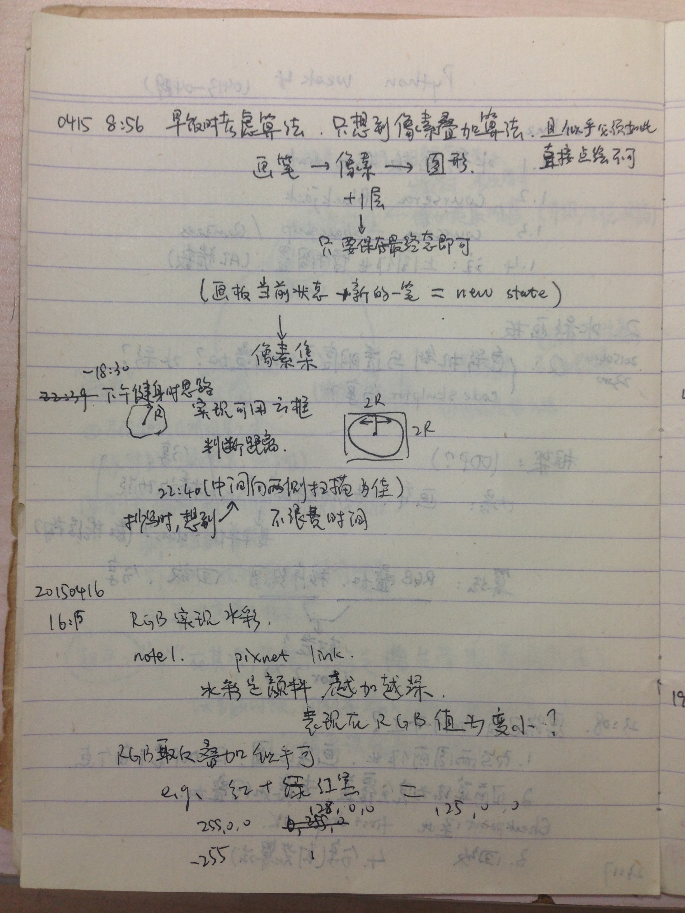
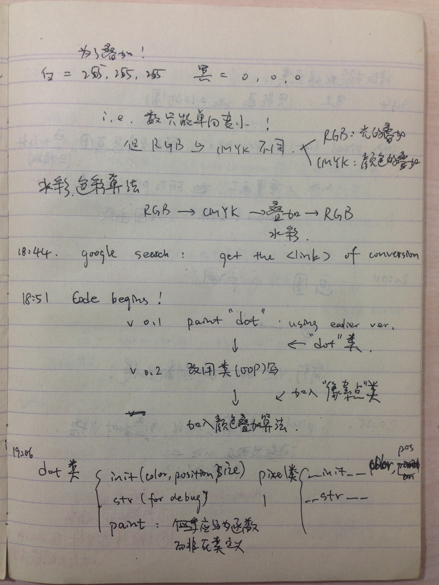
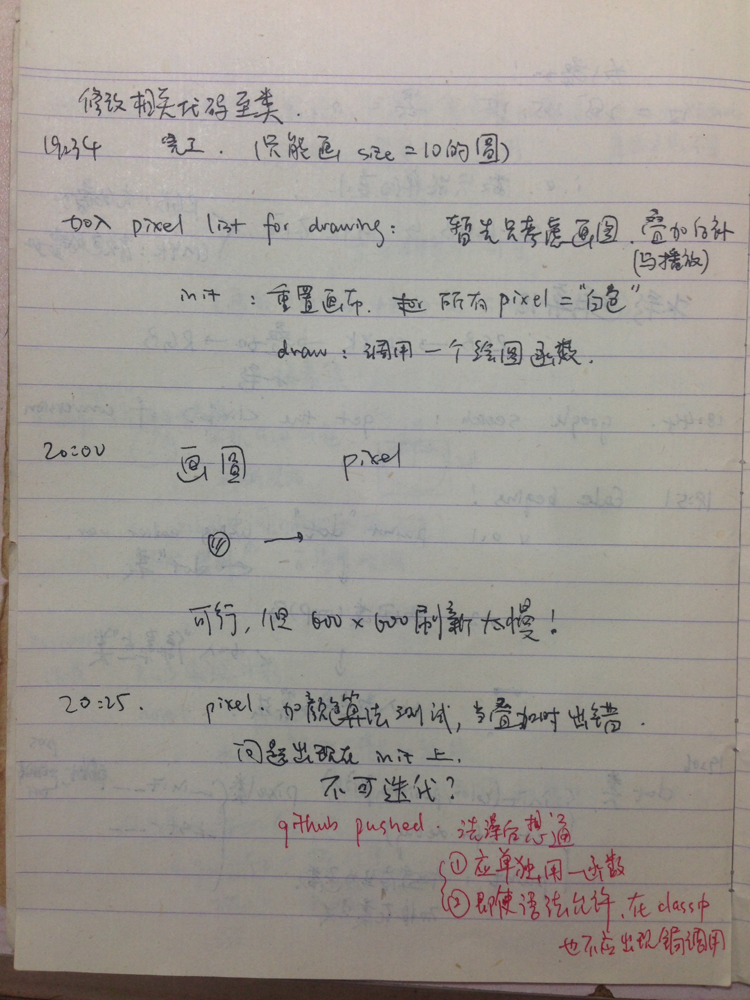
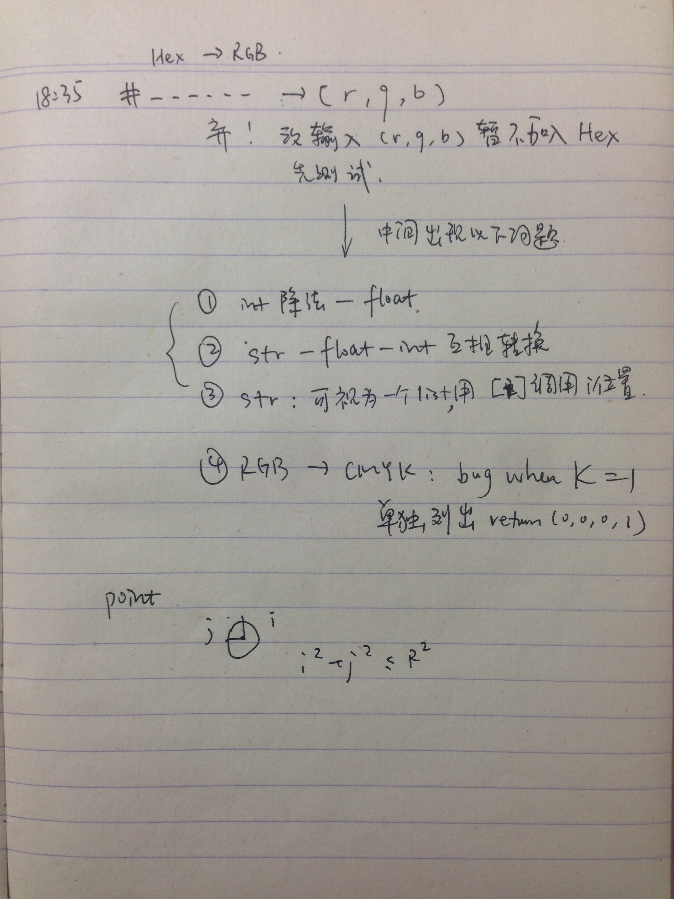

# Hacker and painter, watercolor version

### Outline

- 用 shape 和 pixel 两个类构建了画板绘图
- v1.0 初步了解颜色机制(RGB & CMYK). 用 CMYK 实现了颜色叠加算法
- v2.0 晕染算法;
- v3.0 封装, 分享;

### Resourses

[color note found in pixnet](http://ayu6628.pixnet.net/blog/post/4807180-%E8%89%B2%E5%BD%A9%E8%A7%80%E5%BF%B5-%E7%B0%A1%E8%BF%B0rgb%E8%88%87cmyk)

[RGB to CMYK algorithm](http://www.rapidtables.com/convert/color/rgb-to-cmyk.htm)

[CMYK to RGB algorithm](http://www.rapidtables.com/convert/color/cmyk-to-rgb.htm)

### v1.0

debug in later:

20140420

issue #1: 奇怪的不绘图 bug

codeskulptor点不能画出,但 console 反馈程序接到了绘图指令

在点重叠后即似乎变正常

本地则初看正常,仔细看同样不对: 颜色反馈不对!

最终发现问题是变量初始值定义不对导致画不出图,而更改颜色后则正确了,故出现了不绘图 bug

https://github.com/Frank-the-Obscure/pythoncamp0/commit/f0471dd4b8082a80eaa8ce29d540a02533b8a326

issue #2: 灰色叠加 bug

发现灰色叠加会变成黑色= =

分解定位 bug 所在(避免大海捞针): `这个问题一定出在颜色转换模块`

提取出几个相关函数单独分析

手动输入相关 i/o

用标准 convertor 作为`正对照` (online resource)

迅速解决,根源是不同数字格式之间的运算结果的默认类型

https://github.com/Frank-the-Obscure/pythoncamp0/commit/4a2184103c624b298df4bae7420833ad9fb2b558

### v2.0
实现 v1.0-1.1后, 加入晕染, 只需改变绘制 Drawing 时,绘制 Pixel 的方式. 从统一颜色改为渐变颜色.